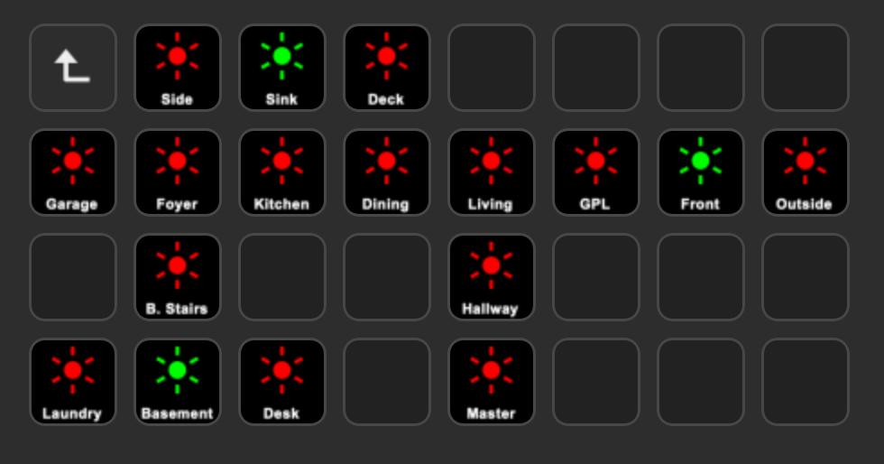
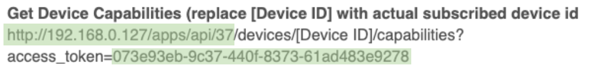
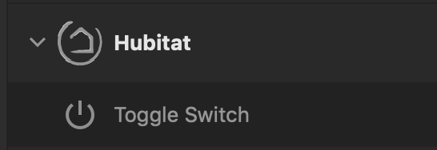
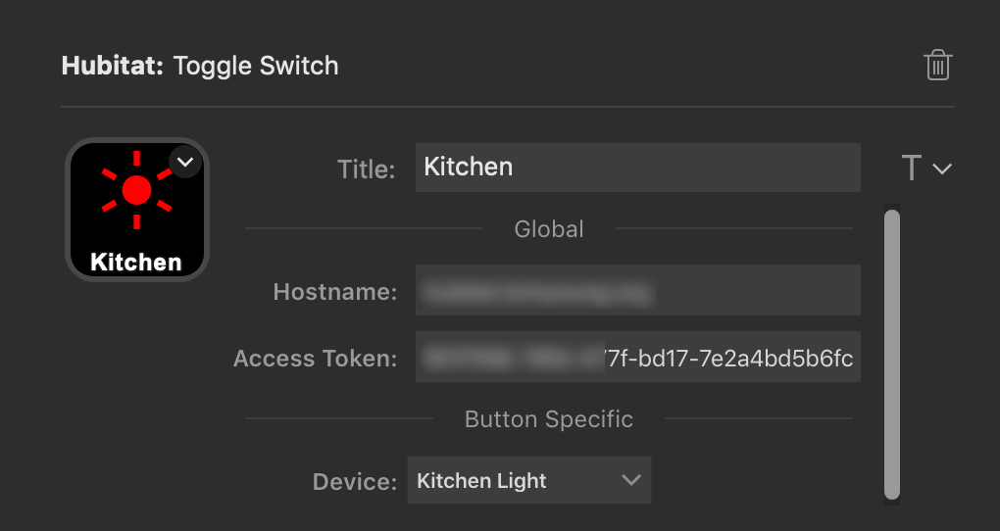

# steamdeck-hubitat
[Hubitat](https://hubitat.com/) integration for the [Elgato Stream Deck](https://www.elgato.com/en/gaming/stream-deck)

# Documentation

## Introduction
This plugin uses the Hubitat's Maker API and websockets to allow Stream Deck to control devices.

## Setup

### Hubitat
Install the [Maker API](https://docs.hubitat.com/index.php?title=Maker_API) app into Hubitat.

Make note of your `access_token`. 

### Stream Deck
Download the latest release from the [Releases](https://github.com/ripnet/streamdeck-hubitat/releases) page.

You should see the new category in the Stream Deck App

Drag the `Toggle Switch` action to a free button slot. Configure the button with the hostname (or IP address) of your hubitat. Paste in your `access_token` from the Maker API.
Click away from the input field and if everything has been setup properly, the list of devices should populate. Select the device you want to control and give it a name.

## Colors
Gray = No/Unknown Status

Green = Switch On

Red = Switch Off

# Support
Please use GitHub Issues for bugs or feature requests. Join me on my [Discord Server](https://discord.gg/J5tSRCMNbz) if you have any questions.

# License
`streamdeck-hubitat` is licensed under the [MIT License](LICENSE)
